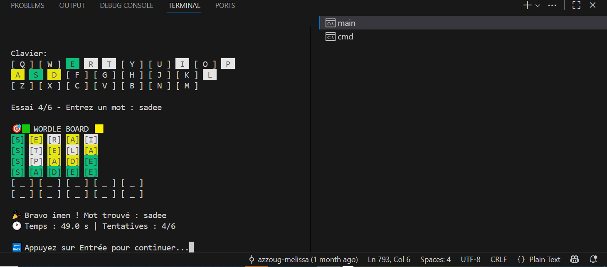

# Wordle Game in C with Automatic Solver

## Quick Overview
- **Description:** Classic Wordle game in C with a heuristic-based automatic solver.
- **Installation:** How to clone the repository and set up the environment.
- **Windows Setup:** Command to enable proper display of emojis and colors on Windows.
- **Compilation:** How to compile the C code into an executable.
- **Running the Program:** Instructions to run the game on Linux, macOS, or Windows.
- **Usage Example:** Example outputs for manual mode and auto-solver mode.
- **Screenshots:** Placeholders for terminal screenshots of the game in action.
- **Files in Repository:** List of included files like source code, dictionary, report, and screenshots.
- **Authors:** Names of the project contributors.

---

## Description
This project implements the classic Wordle game in C, including a **heuristic-based automatic solver**.  
The game follows the original Wordle rules: a hidden 5-letter word, a maximum of six attempts, and colored feedback indicating correct, misplaced, or absent letters.  
Players can play manually, see solver suggestions, or watch the auto-solver play alone. A duel mode (player vs player or player vs solver) is also included.

---

## Getting Started

### Prerequisites
- GCC compiler (or any C compiler)
- Terminal / Command prompt

### Installation
Clone the repository:
```bash
git clone https://github.com/iman184/World-Solver.git
cd wordle-c
Windows Terminal Setup
Before running the program on Windows, set the code page to UTF-8 so that colors and emojis display correctly:

bash
Copier le code
chcp 65001
Compilation
Compile the main C file:

bash
Copier le code
gcc wordle_complete_with_auto_solver.c -o wordle
Running the Program
Run the executable:

bash
Copier le code
./wordle    # Linux / macOS
wordle.exe  # Windows
Usage Example
Manual Mode:

yaml
Copier le code
Enter your name: Zighed Imen
Welcome to Wordle in C!
Choose a mode:
 (1) Manual
 (2) Solver Suggestions
 (3) Auto-Solver
Your choice: 1

Attempt 1/6: apple
Feedback: G _ Y _ _
Auto-Solver Mode:

python-repl
Copier le code
Solver chooses: house
Feedback: _ G _ Y _
...
 Solver found the word in 4 attempts!
Screenshots
Manual Mode:

Auto-Solver Mode:

## Screenshots

**Manual Mode:**  


Files in this Repository
wordle_complete_with_auto_solver.c – Source code of the game and solver.

words.txt – Dictionary of valid 5-letter words.

Wordle_Solver_Report_Final_Corrected.pdf – Written analysis, justification, and code documentation (Part 3).


**Auto-Solver Mode:**  


Authors
Zighed Imen

Azzoug Mélissa